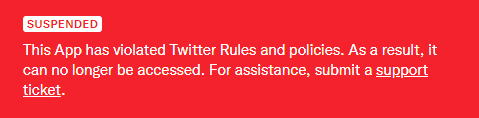

Twitter Account Data Crawler
============================
[](LICENSE.md)

A 'smol' program that **crawls following/followers/statuses count data from Twitter account profile page** using [Selenium](https://www.selenium.dev/), and put the crawled data into [MySQL](https://www.mysql.com/) database using [PyMySQL](https://pypi.org/project/pymysql/).

The purpose of this program is to record the followers count daily and see how the count changes everyday. **MAYBE THIS IS NOT PRODUCTION-READY**, so use this with caution!


Why? You Can Simply Use Twitter API, Aren't You?
------------------------------------------------


**YES, I HAD.** but one day Twitter suspended my API application, even though I didn't overuse or abuse it! ~~Probably this is an Elon thing~~

Source code of original implementation, which uses Twitter API using [`python-twitter`](https://github.com/bear/python-twitter), is stored in [`old`](old/) directory.


Deal With Docker
----------------
[`Dockerfile`](Dockerfile) is ready, in both current and old(original) source tree.

To build:
```sh
$ cd <root-directory-of-source>
$ docker build -t twitter-account-data-crawler:latest .
```

After build, run:
```sh
$ docker run -d \
             --name twitter-account-data-crawler \
             -v <path-of-config.yaml>:/app/config/config.yaml \
             twitter-account-data-crawler
```
You have to prepare configuration file(`config.yaml`). Please refer [the example config file](config/config.example.yaml) and create your own.

If you're using [Podman](https://podman.io/), just replace `docker` with `podman` in command line.


Deal Without Docker
-------------------
You may still run the program without Docker or OCI-compliant runtimes. Just directly run `index.py` using Python 3 like: `$ python index.py`.

Configuration file(`config.yaml`) should be exist in `config` folder.


Database Table Structure
------------------------
Currently only MySQL(and probably MySQL-based DBMS like [MariaDB](https://mariadb.org/)) is supported.

Creating tables per target account is recommended.

The table AT LEAST should have these columns:
  - `date`: type **date**
  - `following_count`: type **int**, unsigned
  - `follower_count`: type **int**, unsigned
  - `tweet_count`: type **int**, unsigned

An example SQL query for these columns:
```sql
CREATE TABLE `account_track_table` (
  `date` date NOT NULL,
  `following_count` int UNSIGNED DEFAULT NULL,
  `follower_count` int UNSIGNED NOT NULL,
  `tweet_count` int UNSIGNED DEFAULT NULL
) ENGINE=InnoDB DEFAULT CHARSET=utf8mb4 COLLATE=utf8mb4_unicode_ci;
```
